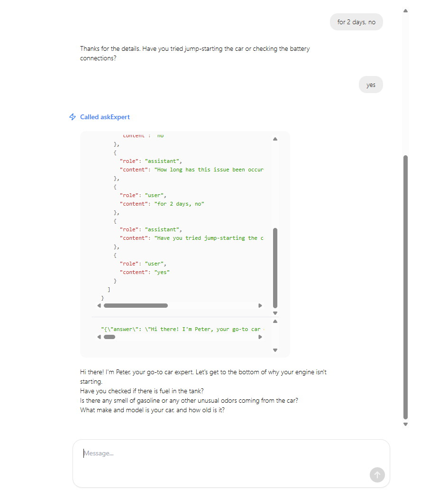

# 🧠 AI + Human Expertise Sample Web Chat App  
**An OpenAI Responses API integration with Pearl API via MCP**

This sample application extends the [OpenAI Responses Starter App](https://github.com/openai/openai-responses-starter-app) to demonstrate how to integrate OpenAI's `responses` API with the **Pearl MCP Server**, enabling your AI agents to seamlessly escalate queries to **real human experts**.

---

## 🚀 Features

- Integrated with **Pearl's Remote MCP Server** via OpenAI’s Responses API MCP tool interface  
- Automatically escalates user questions to human Experts using the `askExpert` tool  
- Supports secure authentication with Pearl via bearer token  
- Real-time response streaming with AI + human blended answers

---

## 🛠️ Installation

Clone this repo and install dependencies:

```bash
git clone https://github.com/Pearl-com/openai-pearl-mcp-demo.git
cd openai-pearl-mcp-demo
npm install
```

Create a `.env` file in the root with the following variables:

```env
OPENAI_API_KEY=your-openai-api-key
PEARL_API_KEY=your-pearl-api-key
```

---

## 🧩 How It Works

This app leverages OpenAI's hosted **Model Context Protocol (MCP)** integration to connect with Pearl’s MCP server. The server provides tools like `askExpert` that route queries to real, credentialed professionals.

### 🔗 Pearl MCP Tool Configuration

Here’s how the `tools` block is defined inside the `openai.responses.create()` call:

```ts
const events = await openai.responses.create({
  model: MODEL,
  input: messages,
  tools: [
    {
      type: "mcp",
      server_label: "pearl-api-mcp-server",
      server_url: "https://pearl-api-mcp-server.pearlapi.workers.dev/mcp",
      require_approval: "never",
      allowed_tools: ["askExpert"],
      headers: {
        Authorization: `Bearer ${process.env.PEARL_API_KEY}`,
      },
    },
  ],
  stream: true,
  parallel_tool_calls: false,
  instructions: SYSTEM_PROMPT,
});
```

### 🔐 Pearl MCP Authentication

Pearl MCP server uses **Bearer token authentication**, passed via the `Authorization` header. Contact [Pearl](https://www.pearl.com/contact) to obtain your API key.

---

## 🧪 Example Use Case

A user asks:

> “Is this clause legally binding?”

The AI recognizes the need for expert legal input, invokes `askExpert` via the MCP interface, and Pearl routes the query to a certified lawyer. The expert's response is streamed back and incorporated into the AI's final output.

---

## 🧠 About Pearl MCP

The **Pearl MCP Server** offers human expertise as a tool, making it possible to enrich AI-driven workflows with real-time, on-demand access to professionals in law, finance, medicine, automotive, and more.

Pearl MCP is:
- Fully compliant with OpenAI’s MCP protocol  
- Secure (Bearer tokens)  
- Scalable across categories  
- Built on Cloudflare Workers for ultra-low latency

---

## 📸 Screenshot
Here’s an example of the Pearl MCP tool call in action:



---

## 🧱 Built With

- [OpenAI Responses API](https://platform.openai.com/docs/guides/responses)  
- [Next.js](https://nextjs.org/) (or React if applicable)  
- [Pearl MCP Server](https://www.pearl.com/api)  
  (hosted at `https://pearl-api-mcp-server.pearlapi.workers.dev/mcp`)

---
